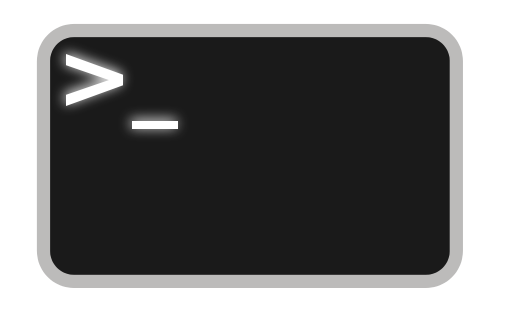

# Hardware Scheme of Work

## Introduction

Using text to command the Raspberry Pi!

## Students will learn

- The difference between hardware and software
- Ways to interact with computers
  - input
  - process
  - output
  - storage
- Differences between Graphical User Interfaces and Command Line Interfaces

## Computing Programme of Study Met

**KS2:**

**KS3:**

- Understand the hardware and software components that make up networked computer systems, how they interact, and how they affect cost and performance

[National Curriculum Computing Programmes of Study](https://www.gov.uk/government/publications/national-curriculum-in-england-computing-programmes-of-study/national-curriculum-in-england-computing-programmes-of-study#key-stage-3)

## Resources

For the majority of the lesson, it is suggested that work is carried out by students on a Raspberry Pi each or in pairs. Each student or pair should have access to the standard equipment described below:

- A Raspberry Pi per pair;
- Latest NOOBS SD card with Raspbian installed per pair;
- espeak downloaded and installed on each SD card;
- A keyboard and mouse connected to the RPi per pair;
- A monitor connected to the RPi per pair;
- A headphone splitter connected to the RPi audio jack per pair from lesson 3 onwards;
- A pair of headphones connected to the splitter per student from lesson 3 onwards.

*Note: These lessons will use Python 3*

See the [teacher setup instructions](/teacher-instructions.md) for more information.

## Lessons

- [Lesson 1](Lesson-1/lesson-plan-1.md)

## Community

## Licence

Unless otherwise specified, everything in this repository is covered by the following licence:

***Hardware Lessons*** by the [Raspberry Pi Foundation](http://raspberrypi.org) is licenced under a [Creative Commons Attribution 4.0 International License](http://creativecommons.org/licenses/by-sa/4.0/).

Based on a work at https://github.com/raspberrypilearning/hardware-lessons
